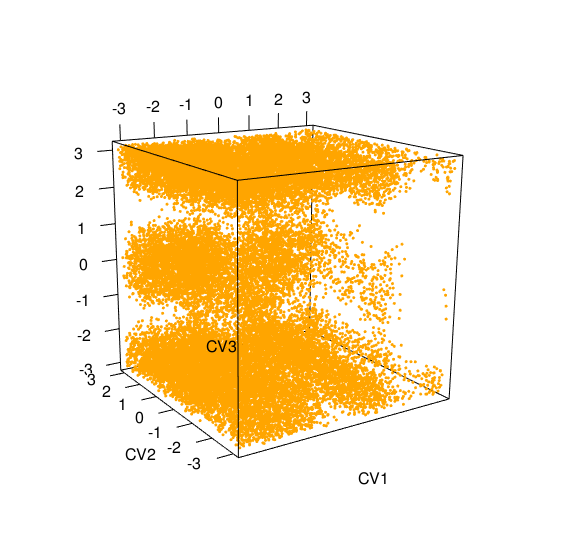
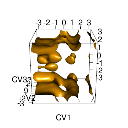

[](https://github.com/spiwokv/metadynminer3d/actions/) 
[](https://ci.appveyor.com/project/spiwokv/metadynminer3d) 
[](https://cran.r-project.org/package=metadynminer3d) 
[](https://cran.r-project.org/package=metadynminer3d)
[](https://www.rdocumentation.org/packages/metadynminer3d)
[](https://app.codecov.io/gh/spiwokv/metadynminer3d/)

# MetadynMiner3d

## Web site
https://metadynamics.cz/metadynminer3d/

https://spiwokv.github.io/metadynminer3d/ ([pkgdown](https://pkgdown.r-lib.org/) web)

## Introduction
MetadynMiner is R packages for reading, analysis and visualization of metadynamics HILLS files produced by Plumed.
It reads HILLS files from Plumed, calculates free energy surface by fast Bias Sum algorithm, finds minima and analyses
transition paths by Nudged Elastic Band method.

MetadynMiner3d is its addendum for plotting 3D free energy surfaces. It uses RGL package. MetadynMiner3d installs and
loads metadynminer automatically.

## Usage
```R
# Install from R repository
install.packages("metadynminer3d")

# Install from GitHub by devtools
install.packages("devtools")
devtools::install_github("spiwokv/metadynminer3d")

# Load library
library(metadynminer3d)
# Read hills file
hillsf<-read.hills3d("HILLS", per=c(TRUE, TRUE, TRUE)) # HILLS with periodicity on CV1, CV2 and CV3

# Sum two hills files
hillsf+hillsf

# Summary of a hills file
summary(hillsf)

# Plot CVs
plot(hillsf)
```

```R
# Plot heights
plotheights(hillsf)
```

```R
# Calculate FES by bias sum (alternatively use fes2 for conventional calculation)
tfes<-fes(hillsf)

# Calculate FES for given range (indexes of hills)
tfes<-fes(hillsf, imin=5000, imax=10000)

# Sum two FESes
tfes+tfes

# Calculate and subtract min, max or mean from a FES
tfes<-tfes-min(tfes)

# Summary of FES
summary(tfes)

# Plot FES
plot(tfes, level=20)
```

```R
# Find minima
minima<-fesminima(tfes)

# Summary of minima
summary(minima)

# Plot free energy minima
plot(minima)
```

```R
# Calculate free energy profile for minima
prof<-feprof(minima)

# Plot free energy profile for minima
plot(prof)
```


## Tips and Tricks
### Publication quality figures
Following script can be used to generate a publication quality figure:
```R
hillsf<-read.hills3d("HILLS", per=c(TRUE, TRUE, TRUE))
tfes<-fes(hillsf)
plot(tfes)
```
Change window size, zoom in and rotate if necessary, then (without closing the window) type:
```R
rgl.snapshot(filename="plot.png")
```

### Publication of interactive FES on web
You can save free energy surface in WebGL and present it on a web site by typing:
```R
writeWebGL(filename="fes3d.html")
```
[fes3d.html](https://htmlpreview.github.io/?https://github.com/spiwokv/metadynminer3d/blob/master/figs/fes3d.html)

### Making movie
It is possible to make movie of rotation of the plot by:
```R
movie3d(spin3d(axis=c(0,0,1)), duration=3, dir=".", type="gif")
```
This will create a three-second animated GIF `movie.gif` file of rotation around z-axis.


### Modifying aspect ratio of box
The aspect ratio of the box can be modified by:
```R
aspect3d(2, 1, 1)
```
after `plot` command. This makes the x-axis twice longer than other axes. 

## Training
[MetadynMiner Webinar video](https://youtu.be/W8N-G8d0or4)

[Plumed Masterclass tutorial](https://www.plumed.org/doc-master/user-doc/html/masterclass-22-02.html)

[Plumed Masterclass video 1](https://youtu.be/T8a-kP6V3_g)

[Plumed Masterclass video 2](https://youtu.be/q1D39A_LQag)

## Contact
Vojtech Spiwok - spiwokv{youknowwhat}vscht.cz

To contribute, se [CONTRIBUTING.md](./CONTRIBUTING.md)

